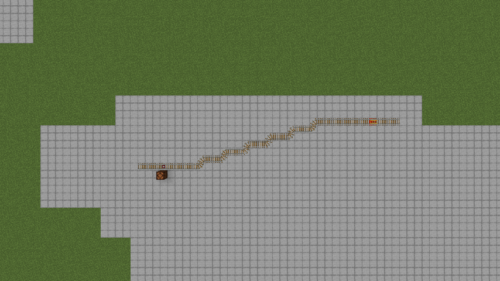
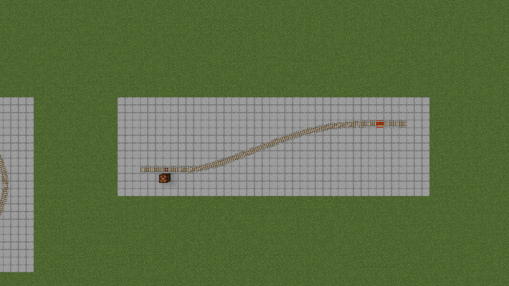
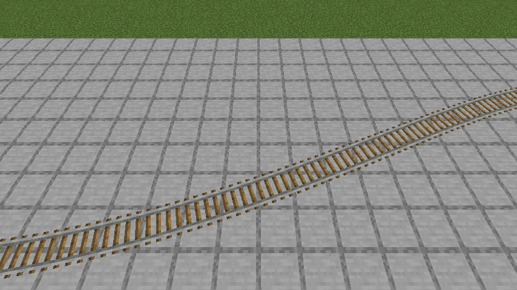

# SlashRails

Long, gentle rail curves in Minecraft come out as staircases: straight runs joined by corner
rails. They look like a zigzag, and a minecart ride over them jerks sideways and snaps its
heading at every step.

SlashRails turns them into real curves. Use the **Track Smoother** on a rail and the whole run
becomes one smooth curve: drawn smooth, and ridden smooth by ordinary vanilla minecarts.

| Vanilla | Smoothed |
|---|---|
|  |  |

## How to use it

1. Craft a **Track Smoother** (rail, iron ingot, stick — diagonal, stick at the bottom left) or
   take one from the Tools & Utilities creative tab.
2. Hold it and look at a rail. A green line previews the curve it would make.
3. Use it on the rail. The connected run of flat rails becomes a smooth curve.
4. Use it again on a smoothed rail to turn the run back into vanilla rails.

Build the curve you want with ordinary rails first — a gentle staircase for a gentle curve.
SlashRails follows what you built; it doesn't invent a new route.

## What stays vanilla

- **The rails are still vanilla rails.** Powered rails, detector rails and activator rails inside a
  smoothed run keep working. Remove the mod and the world is exactly as you built it.
- **The carts are vanilla minecarts.** No special cart, nothing to craft.
- **Tight spots stay safe.** Where there are blocks right beside the track (a tunnel, a wall, a
  lamp), the curve keeps to the vanilla line so carts don't scrape.
- **Breaking any rail in a smoothed run** turns that run back into vanilla rails.

## Numbers

Measured by the built-in self-test on a dedicated server: the largest change of direction a cart
makes in a single tick.

| Track | Vanilla | Smoothed |
|---|---|---|
| Staircase 1:2 | 79.5° | 2.1° |
| Staircase 1:4 | 73.0° | 1.6° |
| Staircase 1:8 | 79.5° | 1.7° |
| Quarter circle, radius 16 | 78.9° | 1.3° |
| S-bend, radius 10 | 79.8° | 2.5° |
| Loop, radius 10 | 78.6° | 1.7° |

## Requirements and limits

- Minecraft **1.20.1 through 26.3**:
  - Fabric (with Fabric API) on every version.
  - NeoForge on 1.20.4 and on 1.20.6 and later.
  - MinecraftForge 1.20.1 — the same jar also runs on NeoForge 1.20.1.
- Works with Sodium (tested 0.6.13) and Iris shaders (tested 1.8.8 on Fabric), on 1.21.1.
- Needed on **both** the server and every client.
- Flat track only for now: a run stops where the track goes up or down a slope.
- A single sharp 90° corner can only be rounded a little — it stays a tight turn.
- Tested with ridden minecarts and hopper carts. Furnace minecarts haven't been tested on curves yet.
- With Minecraft's experimental minecart physics turned on (1.21.2+ "Minecart Improvements"), carts
  ride the vanilla line; the smoothed curve is still drawn.
- On NeoForge 26.1 and later, NeoForge no longer lets rails change a passing cart's behaviour, so
  modded rails in a smoothed run act like plain vanilla ones.

## Server config

`config/slashrails.properties`:

| Key | Side | Default | Meaning |
|---|---|---|---|
| `maxRunLength` | server | 512 | Longest run the Track Smoother will smooth, in rails |
| `opOnlyTool` | server | false | Only operators may use the Track Smoother |
| `toolPreview` | client | true | Show the green preview line while holding the tool |
| `debugOverlay` | client | false | Draw every smoothed run's centre line |

Operators also get `/slashrails list`, `/slashrails testtrack …` and `/slashrails selftest`.

## License

[Creative Commons Attribution 4.0 International (CC-BY-4.0)](https://creativecommons.org/licenses/by/4.0/). See `LICENSE`.

---

SlashRails is made by The Block Academy. Not an official Minecraft product; not approved by or
associated with Mojang or Microsoft.
